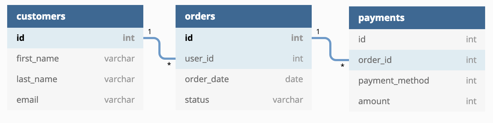

Welcome to your new dbt project!

<<<<<<< HEAD
The raw data from the app consists of customers, orders, and payments, with the




This [dbt](htt


3. Create a profile.yml to connect to DWH and populate following the instructions in profiles.template.yml

```bash
mkdir ~/.dbt && touch ~/.dbt/profile.yml
```


```bash
$ cd dbt
```

5. Ensure your profile is setup correctly from the command line:

```bash
```

6. Load the CSVs with the demo data set. This materializes the CSVs as tables in
  your target schema. Note that a typical dbt project **does not require this
  step** since dbt assumes your raw data is already in your warehouse.

```bash
$ dbt seed
```

7. Run the models:

```bash
$ dbt run
```

> **NOTE:** If this steps fails, it might be that you need to make small changes to the SQL in the models folder to adjust for the flavor of SQL of your target database. Definitely consider this if you are using a community-contributed adapter.

8. Test the output of the models:

```bash
$ dbt test
```

9. Generate documentation for the project:

```bash
$ dbt docs generate
```

10. View the documentation for the project:

```bash

$ dbt docs 

$ dbt docs servess

```

### What is a jaffle?

A jaffle is a toasted sandwich with crimped, sealed edges. Invented in Bondi in 1949, the humble jaffle is an Australian classic. The sealed edges allow jaffle-eaters to enjoy liquid fillings inside the sandwich, which reach temperatures close to the core of the earth during cooking. Often consumed at home after a night out, the most classic filling is tinned spaghetti, while my personal favourite is leftover beef stew with melted cheese.

=======
### Using the starter project

Try running the following commands:
- dbt run
- dbt test


### Resources:
- Learn more about dbt [in the docs](https://docs.getdbt.com/docs/introduction)
- Check out [Discourse](https://discourse.getdbt.com/) for commonly asked questions and answers
- Join the [chat](http://slack.getdbt.com/) on Slack for live discussions and support
- Find [dbt events](https://events.getdbt.com) near you
- Check out [the blog](https://blog.getdbt.com/) for the latest news on dbt's development and best practices
>>>>>>> b2d7ad4a12fe20ba9cb8ae038a64bb6207acbffe
